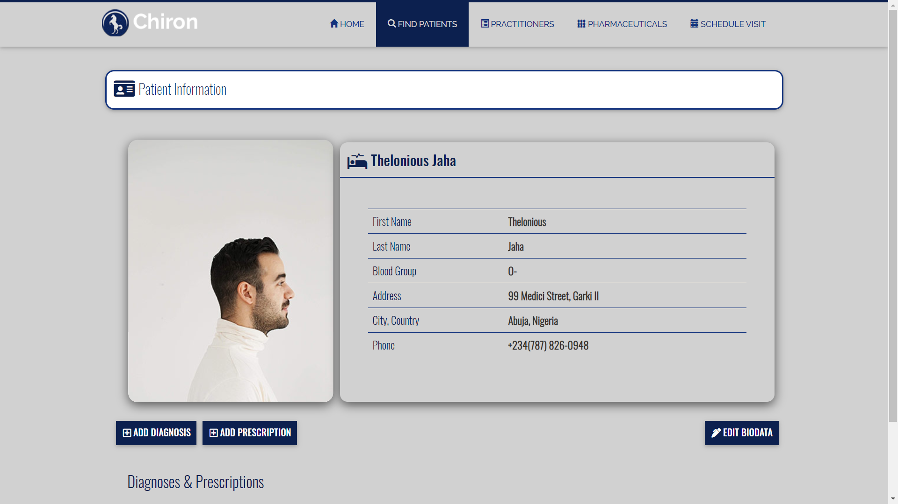
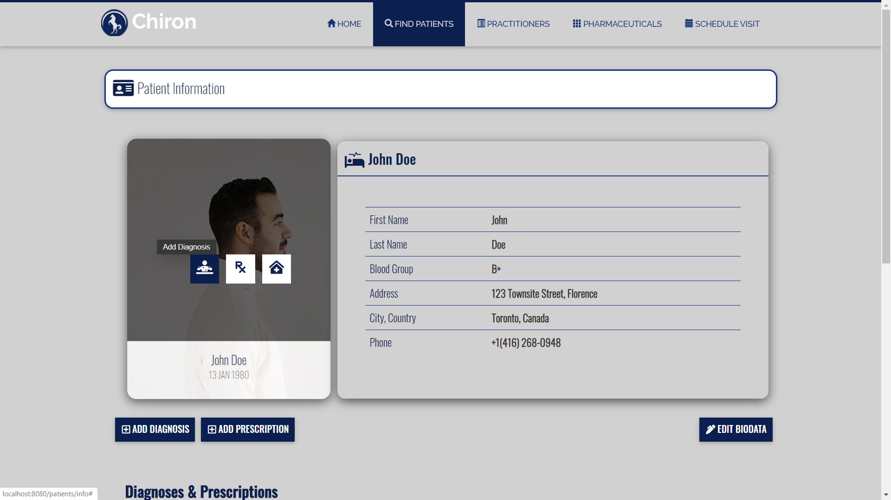
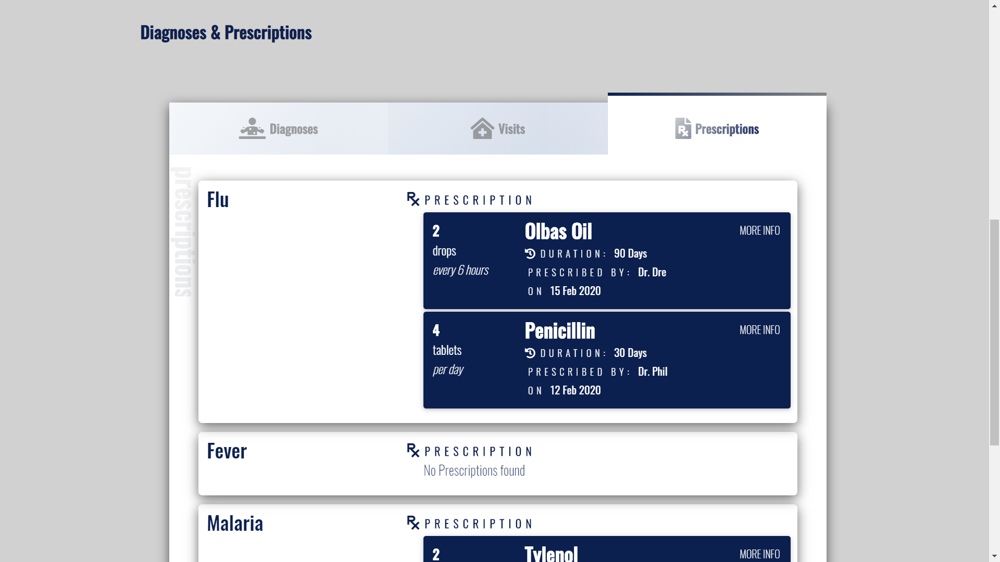

# Chiron /ˈkaɪrən/
## Medical Practice Management System (Spring Web MVC)

### Overview

Chiron is a modest medical practice management <em>enterprise web application</em> with the objective functionality of managing the day to day operations of a small-scale or remote clinic - such as patient management, pharmaceuticals inventory and other vital administrative tasks. The application architecture design is in adherence to the MVC (Model-View-Controller) approach and Repository Pattern; with an emphasis on the separation of the respective layers for the additional benefit of long-term scalability, seamless modification and testing. Built using using Java, Spring, Spring Boot, Thymeleaf, Bootstrap: Material Design UI Components, Hibernate, Java Persistence API, H2 DBMS, PostgreSQL, Mongo DB, Circle CI and Docker container for agnostic cloud deployment. 

## Related Links

**Portfolio URL >_** https://www.emekaegwim.com/portfolios/chiron/

**App URL >_** 

## Setup
&nbsp;
## System Requirements
&nbsp;
## Installation

### Deployment

  

&nbsp;

&nbsp;  

&nbsp;  

