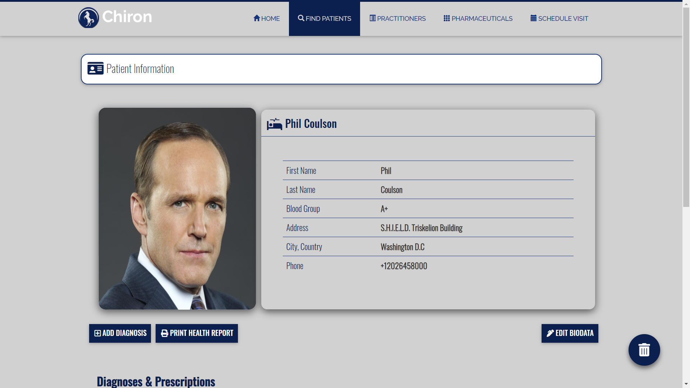

[](https://circleci.com/gh/emeraldemperaur/chiron)

# Chiron /ˈkaɪrən/
## Medical Practice Management System (Spring Web MVC)


### Overview
<p align="justify">Chiron is a modest medical practice management <em>enterprise web application</em> with the objective functionality of managing the day to day operations of a small-scale or remote clinic - such as patient management, pharmaceuticals inventory and other vital administrative tasks. The application architecture design is in adherence to the MVC (Model-View-Controller) approach and Repository Pattern; with an emphasis on the separation of the respective layers for the additional benefit of long-term scalability, seamless modification and testing. Built using using Java, Spring, Spring Boot, Thymeleaf, Bootstrap: Material Design UI Components, Hibernate, Java Persistence API, H2 DBMS, PostgreSQL, Mongo DB, Circle CI and Docker container for agnostic cloud deployment. 


## Related Links

**Portfolio URL >_** https://www.mekaegwim.ca/portfolio/
<br>
**Demo URL >_** https://chironapp-cloud.herokuapp.com/

## Setup
<h5>Option 1:</h5>Download Docker Image from Docker repository via terminal
&nbsp;

```
docker pull emeraldemperaur/theforge:chiron-version1
```
<h5>Option 2:</h5>Build Docker Image from Git repository via terminal<br>
->> Pull Prometheus project from Git and execute maven build for .JAR <br>
->> Build Docker Image from Chiron Web .JAR using Dockerfile

```
Dockerfile

FROM centos
RUN yum install -y java
VOLUME /##specifiedvolumename##
ADD / ##CHIRONJARFILENAME.jar## ##specifiedname.jar##
RUN sh -c 'touch /##specifiedname.jar##'
ENTRYPOINT ["java", "-Djava.security.egd=file:/dev/./urandom", "-jar", "/##specifiedname.jar##"]
```

## System Requirements

```
-->> Docker
-->> Linux: CentOS/Ubuntu (Recommended) 
-->> 8GB+ RAM (Recommended)
-->> Database: H2/MySQL/PostgreSQL
-->> Java
```

&nbsp;
## Installation
Create MySQL database on default port 3306 in compliance with modified driver access credentials in Chiron application.properties

```
spring.datasource.url=jdbc:mysql://localhost:3306/databasename
spring.datasource.username=root
spring.datasource.password=password
```


### Deployment
<h5>Option 1:</h5>->> Deploy Chiron and SQL containers built with externally exposed ports to Heroku, AWS, Azure via CI/CD pipeline
<br>&nbsp;

```
docker run -d -p 8080:8080 #chiron-image#
docker run -d -p 3306:3306 #sql-image#
```

<h5>Option 2:</h5>->> Run directly on Localhost server with Public IP

<br><br>
### Screenshots
&nbsp;

&nbsp;<br><br>

&nbsp;<br><br>

&nbsp;<br><br>

&nbsp;<br><br>

&nbsp;<br><br>

&nbsp;<br><br>

&nbsp;<br><br>

&nbsp;<br><br>

&nbsp;<br><br>

&nbsp;<br><br>

&nbsp;<br><br>

&nbsp;<br><br>

&nbsp;<br><br>

&nbsp;<br><br>


